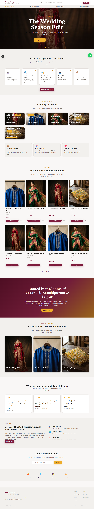
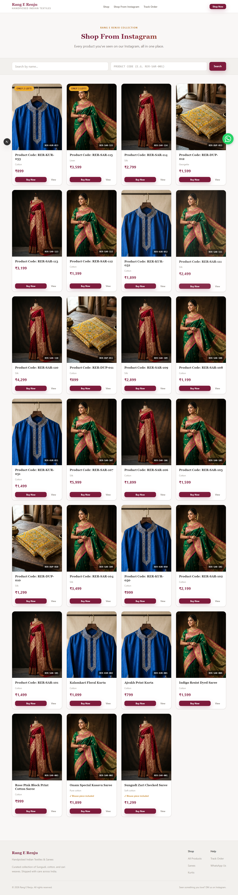
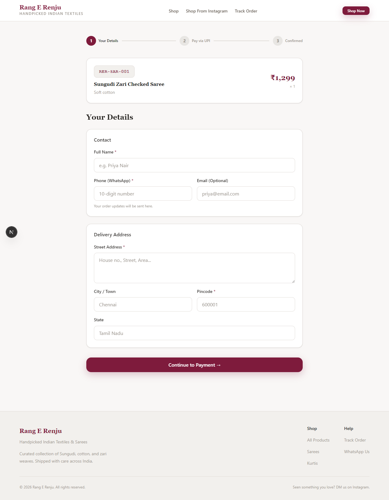
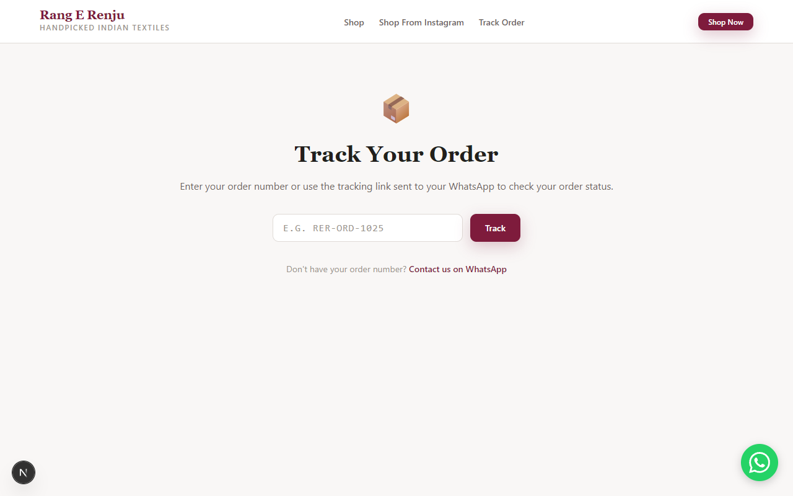

<!-- slide -->
# storefront Rang E Renju
**From Instagram to Scaling Your Business**

 
Welcome, Rang E Renju Team! We're excited to show you the new custom e-commerce platform we've built, focusing on speed, usability, and beautiful design.

  arrow_forward

---

<!-- slide -->
# trending_down The Current Journey
**The Challenge:**

Currently, managing Instagram DM sales involves:
<ul>
  <li>cancel <strong>Manual Work:</strong> Typing codes, sharing UPI, tracking stock.</li>
  <li>warning <strong>Lack of Accountability:</strong> Messages get lost.</li>
  <li>monitoring <strong>Limited Analytics:</strong> Hard to know what drives traffic.</li>
</ul>

  lightbulb
  
<strong>The Solution:</strong> An automated web store that connects with your Instagram presence, reducing manual workload while retaining your personal touch.

---

<!-- slide -->
# explore The New Customer Journey 
**Designed for Discovery**

**Key Features:**
<ul>
  <li>auto_awesome <strong>Hero Section:</strong> Instantly showcases your collection.</li>
  <li>school <strong>How It Works:</strong> Educates the customer (Discover → Search → Pay).</li>
  <li>search <strong>Direct Code Search:</strong> Dedicated input field for product codes.</li>
</ul>

  smartphone
  
<strong>Mobile First:</strong> Optimized with generous touch targets and fast load times, adhering to Material Design standards.

---

<!-- slide -->
# manage_search The Shop & Product Lookup
**Bridging Instagram and the Web**

**Category Filters:**
Filter seamlessly by "Sarees" or "Kurtis". 

**Product Search:**
<ul>
  <li>bolt 
Fast & Forgiving: Typos and lowercase are handled automatically.
</li>
  <li>inventory_2 
Inventory Sync: Reflects real-time stock. No more "Is this available?" DMs for sold-out items!
</li>
</ul>

---

<!-- slide -->
# verified_user Secure UPI Payment
**Frictionless Purchasing**

<ul>
  <li>no_accounts <strong>No Account Required:</strong> Reduces abandoned carts.</li>
  <li>payments <strong>Direct UPI Integration:</strong> Highlights UPI clearly with clear calls to action.</li>
  <li>shield <strong>Trust Signals:</strong> Emphasizes secure payments and WhatsApp support.</li>
</ul>

  chat
  
<strong>Objection Handling:</strong> Instant WhatsApp confirmations provide a familiar trust layer.

---

<!-- slide -->
# local_shipping Automated Tracking
**Reducing Support DMs**

**Order Tracking:**
Customers visit `/track` for live updates. 

**WhatsApp Integration:**
<ul>
  <li>send Send tracking updates via WhatsApp.</li>
  <li>forum Click-to-chat links pre-fill order details.</li>
  <li>check_circle Replaces chaotic DMs with organized conversations.</li>
</ul>

---

<!-- slide -->
# rocket_launch Let's Launch Your Store!
**Next Steps & Feedback**

**Questions for You:**
<ul>
  <li>checklist How many products are ready to list?</li>
  <li>sync How do you want to handle inventory sync?</li>
  <li>schedule What is your ideal timeline to go live?</li>
</ul>

  favorite
  
<strong>Our Goal:</strong> Smoother operations so you have more time to source beautiful textiles!

  done

